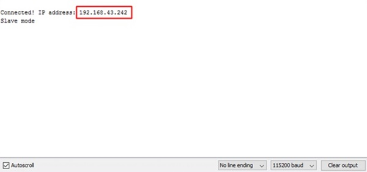

# Unitree

## Introduction
   ในปัจจุบัน เทคโนโลยี ต่างก็มีบทบาทในชีวิตเราเป็นอย่างมาก เข้ามาเป็นส่วนหนึ่งในชีวิตเรา 
   แต่ก็อย่าลืมนะครับ ว่าต้นไม้ ก็เป็นสิ่งสำคัญต่อเราเช่นกัน เราจึงได้ทำการนำเทคโนโลยีเข้ามาช่วยดูแลต้นไม้ 
   โดยจะมี 3 สิ่งที่จะช่วยเป็นตัวแปรสำหรับการรดน้ำต้นไม้ ได้แก่ อุณหภูมิ ความชื้นในอากาศ ความชื้นในดิน 
   หากค่าใดค่าหนึ่งต่ำกว่าค่าที่ผู้ใช้ตั้งค่าไว้ อุปกรณ์ก็จะทำการรดน้ำ
## Require
- NodeMCU v3 LoLin
- DHT11
- Analog Moisture Sensor
- DS3231
- SD Card Module
- Solenoid Valve
## First Time Setting
  1.ตั้งค่า"Wifi Name"และ"Password"โดยไปที่ไฟล์config.h 
   
  2.อัพโหลดลงเครื่องโดยใช้โปรแกรมArduino IDE 
  3.เปิดSerial Monitorเพื่อดูค่าIP Address 
   
  4.ใช้IP Addressเพื่อเข้าเว็บไซด์ดูค่าสถานะกดปุ่มsettingเพื่อไปหน้าตั้งค่า 
   
  
  5.กำหนดค่าอุณหภูมิ ความชื้นในดิน และความชื้นในอากาศและกดปุ่มapply 
   
## Team Members
|  |ชื่อ|นามสกุล|GitHub Username|รหัสนักศึกษา|
|:-:|--|------|---------------|---------|
||Siwawat|Srisuk|[@unixxcorn](https://github.com/unixxcorn)|60070096|
||Sopoat|Iamcharoen|[@sopoat0101](https://github.com/sopoat0101)|60070101|
||Ariya|Sonklin|[@AriyaSonklin](https://github.com/AriyaSonklin)|60070118|
##  Assistant Teacher
|ผศ. ดร. กิติ์สุชาต พสุภา|ผศ. ดร. ปานวิทย์ ธุวะนุติ|
|:-:|:-:|
|||
